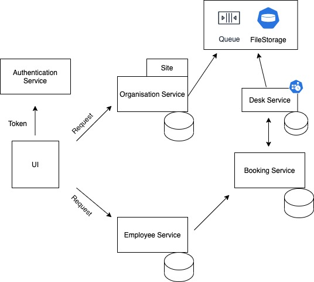
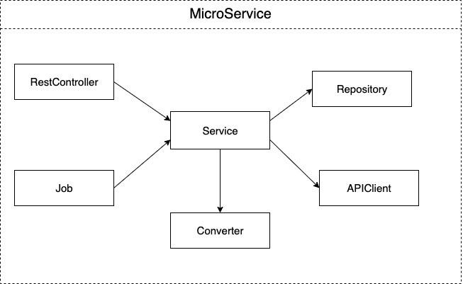
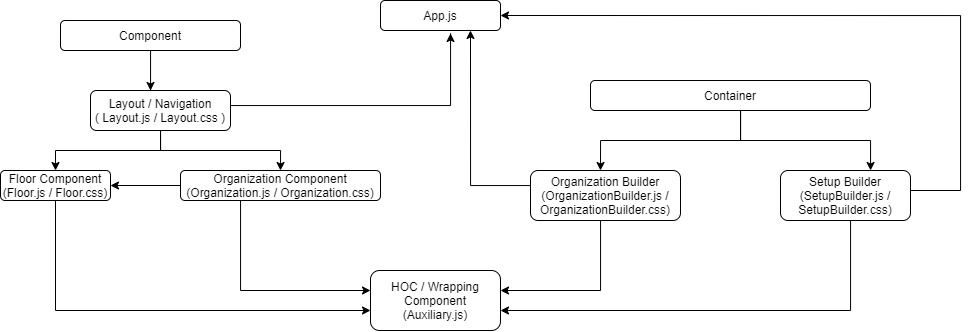
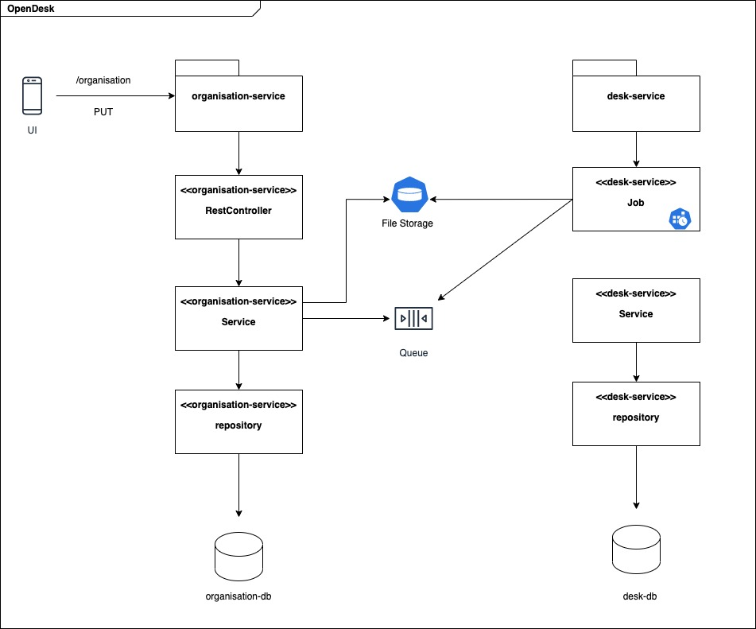

## High Architecture Diagram

- Organisation Service: Microservice to provide api for all organisation related operations like registration, setting up sites.
- Desk Service: Microservice to provide api for desk management operation like adding desk to a site per floor, available and reserved capacity.
- Employee Service: Microservice for operation related to employee preference and bookings.
- Booking Service: Microservice will allow the employee to book or reserve desk.
- Authentication Service: Authentication and authorisation using SSO(Single Sign On).   
- UI: Front end layer that will communicate with microservices to fetch data and perform all operations from UI.

## Microservice Architecture/Layers 

- RestController class will expose api endpoint and talk to other service layers to perform operations and send response back to client.
- Job class will be entry point for micro-service with cron or batch job.
- Service class will perform all business operation, data consolidation, filtering. 
- Converter class is the transformation layer that will convert into desired presentation state e.g. Request Objects(Model) to Data Access Objects(DAO) 
- Repository class will perform database operations e.g. CRUD
- APIClient class will talk to other microservices/endpoints or send messages to queues for the decoupling.

## Frontend Architecture

- Import Layout.js in App.js. Under Layout SetupBuilder.js & OrganizationBuilder.js present.
- Based on login (First time on-boarding / future login), Setup Builder / Organization Builder will come up as a landing page.
- On submit form POST call will happen in SetupBuilder.js, which will insert data for the organization in DB. 
- Import Organization.js in OrganizationBuilder.js, on update state after GET call Organization will upload with previously saved data. Site details will be displayed in Organization cards.
- Import Floor.js in Organization.js. On click on Organization card, Floor.js will upload. Floor.js will contain data of floor details for particular site.
- HOC / Auxiliary.js will wrap all the components.
- CSS files will be along with .js file. As per requirement .css file name can change to .module.css so that css will apply particularly on .js file.

## Organisation boarding flow

- UI will call organisation service to board an organisation.
- Organisation details like name, logo and location will be saved to organisation db.
- Desk details import file will be saved in persistence file storage.
- A message will be sent to queue with desk details and import file path.
- CRON Job inside desk-service will run and process the desk file and save data in desk-db. 